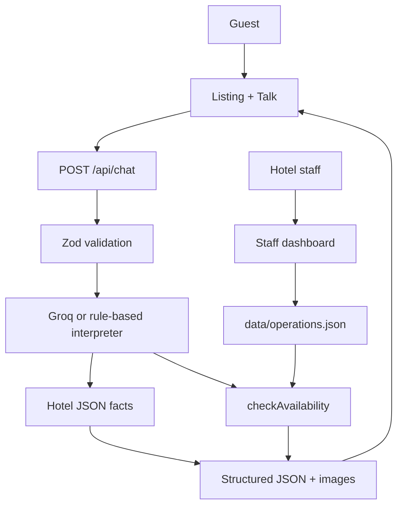

# AI-Powered Hotel Guest Assistant

A small, production-minded guest assistant for the fictional **Asteria Grand Hotel**. Guests can ask about rooms, amenities, and policies, then check a deterministic mock of room availability. The browser never calls the LLM. Hotel facts and inventory stay in backend code.

This repository is sized as a 6–8 hour hiring assignment: one Next.js app, one chat API, one JSON knowledge base, and a mock availability function.

## Demo

Not deployed from this workspace yet. After you deploy to Vercel, replace this line with the production URL.

## Features

- An Airbnb-style listing homepage with a real reception-desk photo grid; Talk opens the host conversation
- Assistant replies include hotel photographs, not text-only bubbles
- Follow-up questions that resolve room references from recent history
- Safe fallback when a service is not in the hotel dataset
- Natural-language availability requests plus a structured date/guest form
- Deterministic `checkAvailability()` with capacity, date, and staff-controlled inventory
- A staff dashboard at `/staff` for inventory, rates, closures, and blackout dates
- Room result cards with nightly and stay totals in INR
- Loading, retry, and validation states
- Unit tests for hotel facts, availability, operations, and the chat API
- Playwright coverage for a full guest flow and staff sign-in

## Tech Stack

- Next.js 16 App Router, React 19, TypeScript
- Tailwind CSS 4
- Zod request/response validation
- Vercel AI SDK with Groq (`@ai-sdk/groq`, default model `openai/gpt-oss-120b`)
- Vitest for unit tests
- Playwright for end-to-end tests

## Architecture



AI is used to understand the guest and, when an API key is present, extract intent and slots. Backend logic validates dates, guest counts, room capacity, prices, policies, and inventory. See [docs/ARCHITECTURE.md](docs/ARCHITECTURE.md).

## Getting Started

```bash
git clone <this-repo>
cd hotel-guest-assistant
npm install
```

Copy environment variables:

```bash
cp .env.example .env.local
```

Set Groq for live language understanding:

```
GROQ_API_KEY=
GROQ_MODEL=openai/gpt-oss-120b
```

If no LLM key is set, the app still runs. Intent detection falls back to a deterministic interpreter so local development and tests do not depend on a live model.

Staff dashboard (local default password `asteria-desk`):

```
STAFF_PASSWORD=asteria-desk
```

Then:

```bash
npm run dev
```

Open [http://localhost:3000](http://localhost:3000).

## Environment Variables

| Name | Required | Purpose |
| --- | --- | --- |
| `GROQ_API_KEY` | No | Groq API key for live intent extraction. Server-only. |
| `GROQ_MODEL` | No | Groq model id. Defaults to `openai/gpt-oss-120b`. |
| `AI_GATEWAY_API_KEY` | No | Fallback if Groq is unset. |
| `LLM_API_KEY` | No | Alias used when Groq and the Gateway key are empty. |
| `LLM_MODEL` | No | Gateway model id. Defaults to `openai/gpt-5.4-mini`. |
| `STAFF_PASSWORD` | No | Staff dashboard password. Defaults to `asteria-desk` in development. |
| `STAFF_SECRET` | No | HMAC secret for the staff session cookie. |

Never put these values in client code or commit `.env.local`.

## API

`POST /api/chat`

Request:

```json
{
  "message": "What time is check-in?",
  "history": [],
  "availability": {
    "checkIn": null,
    "checkOut": null,
    "guests": null
  },
  "source": "chat"
}
```

`source` may be `"chat"` or `"availability_form"`. History is capped at 12 messages.

Example:

```bash
curl -X POST http://localhost:3000/api/chat \
  -H "Content-Type: application/json" \
  -d '{
    "message": "What time is check-in?",
    "history": []
  }'
```

Availability example:

```bash
curl -X POST http://localhost:3000/api/chat \
  -H "Content-Type: application/json" \
  -d '{
    "message": "Please check availability for these dates.",
    "history": [],
    "source": "availability_form",
    "availability": {
      "checkIn": "2026-09-20",
      "checkOut": "2026-09-22",
      "guests": 3
    }
  }'
```

Successful responses always include `type`, `message`, `intent`, `missingFields`, `rooms`, and `images`.

Open [http://localhost:3000/staff](http://localhost:3000/staff) to set inventory, nightly rates, closed rooms, and blackout dates. Those values are stored in `data/operations.json` and are what `checkAvailability()` reads.

| `type` | Meaning |
| --- | --- |
| `answer` | Grounded hotel/room/amenity/policy reply |
| `availability_request` | Dates or guest count still needed |
| `availability_results` | Deterministic inventory result |
| `fallback` | Question is outside the hotel dataset |
| `error` | Validation, model, or availability failure |

## Testing

```bash
npm test
npx playwright install chromium
npx playwright test
```

Playwright starts the Next.js dev server and forces the rule-based interpreter so the flow does not depend on a live LLM.

## AI vs deterministic logic

| AI / interpreter | Backend |
| --- | --- |
| Natural-language understanding | Date validity |
| Follow-up reference resolution | Guest count limits |
| Slot extraction for dates/guests | Room capacity |
| Conversational phrasing when a model is configured | Prices, policies, amenities |
| | Mock inventory and availability |

The model is never asked whether a room is free.

## Failure handling

- Network errors show “Something went wrong while contacting the assistant.” with Retry
- LLM failures show “I'm having trouble generating a response right now. Please try again.”
- Availability failures show “I couldn't check room availability right now. Please try again shortly.”
- Invalid dates and guest counts return a specific validation message
- Unknown services return a useful fallback, not a fabricated “no”

Raw stack traces and API keys are never sent to the browser.

## Evaluation

Observed results from the automated suite live in [docs/EVALUATION.md](docs/EVALUATION.md).

## Product decisions

Design, AI boundaries, and production gaps are documented in [docs/PRODUCT_DECISIONS.md](docs/PRODUCT_DECISIONS.md).

## AI tools used during development

- **Cursor**, with the Grok 4.6 assistant in this workspace
- Used for scaffolding, implementation, test generation, code review, and documentation
- Vercel AI SDK / AI Gateway patterns were followed for the live model path

All generated code and technical decisions were reviewed and understood before submission.

## Deploy on Vercel

1. Push this repository to GitHub
2. Import the project in Vercel
3. Set `GROQ_API_KEY` (and optional `GROQ_MODEL`) plus `STAFF_PASSWORD` for Production and Preview
4. Deploy

Hotel content ships as JSON. Staff inventory is stored in `data/operations.json` on the server filesystem, so a durable store is the next production step.
