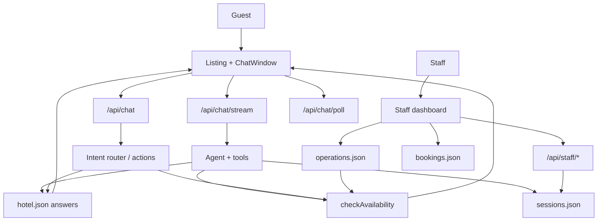

# Asteria Grand Hotel — AI Guest Assistant

A production-minded hotel guest assistant for the fictional **Asteria Grand Hotel**. Guests browse an Airbnb-style listing, chat with Leela at the front desk, check real availability, and request bookings. Staff operate a front-desk console to confirm reservations, take over live chats, and manage inventory.

**Repository:** [github.com/RealBhupesh/Aichatbot](https://github.com/RealBhupesh/Aichatbot)  
**Deployed on:** Vercel (import the GitHub repo to deploy)

---

## What it does

### For guests

- Airbnb-style listing with a reception photo mosaic; **Talk** opens a host conversation with Leela
- Natural-language questions about rooms, amenities, and policies — with hotel photographs in replies
- Follow-up questions (“does it include breakfast?”) without repeating the room name
- Structured date/guest form when exact stay details are needed
- Deterministic room availability with capacity, pricing, and staff-controlled inventory
- **Book the room** flow: guest submits a request with phone → staff confirms → guest receives `AST-xxxx` in chat
- Live streaming replies with tool-status updates when an LLM is configured
- Staff takeover: human front-desk messages appear in the guest thread via polling

### For staff (`/staff`)

- Password-protected dashboard with four tabs: **Overview**, **Conversations**, **Escalations**, **Operations**
- Confirm or decline booking requests (with guest phone link)
- Take over a guest chat, reply as the desk, hand back to Leela
- Adjust inventory, nightly rates, room closures, and blackout dates
- Optional webhook alerts for escalations and booking requests

---

## Tech stack

| Layer | Choice |
| --- | --- |
| Framework | Next.js 16 App Router, React 19, TypeScript |
| Styling | Tailwind CSS 4, DaisyUI 5 |
| Validation | Zod |
| AI | Vercel AI SDK v7 + Groq (`@ai-sdk/groq`, default `openai/gpt-oss-120b`) |
| Unit tests | Vitest (75 tests) |
| E2E tests | Playwright |

The browser **never** calls the LLM. All model traffic goes through server routes.

---

## Architecture at a glance



**Core principle:** AI understands language; backend code owns inventory, prices, policies, and booking state.

For the full decision log, module map, API reference, and deployment notes, see **[docs/ARCHITECTURE.md](docs/ARCHITECTURE.md)**.

---

## Major architectural choices

| Area | Decision |
| --- | --- |
| **Deployment shape** | Single Next.js app — guest UI, staff UI, and APIs in one repo |
| **AI boundary** | Model handles NLU and tool orchestration; `checkAvailability()` and `lib/answers.ts` own facts |
| **Default AI mode** | Agent with tools (`AGENT_MODE=true`) — up to 5 tool steps per turn |
| **Guest transport** | SSE streaming (`/api/chat/stream`) with JSON fallback for forms and actions |
| **Sessions** | Server-side JSON store + `asteria_guest` cookie |
| **Bookings** | Staff-confirmed flow (`pending_staff` → confirm → `AST-xxxx`) — not instant guest confirmation |
| **Staff takeover** | Session `mode` switches `ai` ↔ `staff`; guest UI polls for desk messages |
| **Persistence** | File-backed JSON locally; `/tmp/asteria-data` on Vercel (`lib/data-files.ts`) |
| **No-LLM fallback** | Rule-based interpreter in `lib/interpreter.ts` for dev and CI |
| **Auth** | Staff password + HMAC session cookie; guarded by `proxy.ts` |

Product rationale and hallucination controls: **[docs/PRODUCT_DECISIONS.md](docs/PRODUCT_DECISIONS.md)**

---

## Getting started

```bash
git clone https://github.com/RealBhupesh/Aichatbot.git
cd Aichatbot
npm install
cp .env.example .env.local
```

Add your Groq key to `.env.local`:

```env
GROQ_API_KEY=your_key_here
GROQ_MODEL=openai/gpt-oss-120b
STAFF_PASSWORD=asteria-desk
```

```bash
npm run dev
```

Open [http://localhost:3000](http://localhost:3000) for the guest site.  
Staff desk: [http://localhost:3000/staff](http://localhost:3000/staff) (default password `asteria-desk`).

If no LLM key is set, the app still runs using the rule-based interpreter.

---

## Environment variables

| Name | Required | Purpose |
| --- | --- | --- |
| `GROQ_API_KEY` | For live AI | Groq API key. Server-only. |
| `GROQ_MODEL` | No | Defaults to `openai/gpt-oss-120b` |
| `AGENT_MODE` | No | `true` (default) = tool-calling agent; `false` = legacy intent router |
| `STREAM_MODE` | No | `true` (default) = SSE streaming for agent replies |
| `AI_GATEWAY_API_KEY` | No | Fallback provider via Vercel AI Gateway |
| `LLM_API_KEY` | No | Alias when Groq and Gateway are empty |
| `LLM_MODEL` | No | Gateway model. Defaults to `openai/gpt-5.4-mini` |
| `STAFF_PASSWORD` | Yes on Vercel | Staff dashboard login |
| `STAFF_SECRET` | Recommended | HMAC secret for staff session cookies and hold tokens |
| `STAFF_ALERT_WEBHOOK` | No | Slack/Discord/Zapier webhook for staff alerts |
| `DATA_DIR` | No | Override writable data directory (default: `data/` locally, `/tmp/asteria-data` on Vercel) |

Never commit `.env` or expose keys in client code.

---

## API overview

### Guest chat

**`POST /api/chat`** — JSON response (forms, actions, no-LLM mode)

**`POST /api/chat/stream`** — SSE stream (default for free-text chat)

**`GET /api/chat/poll`** — Sync staff messages during takeover

**`POST /api/chat/new`** — Start a fresh guest session

Example:

```bash
curl -X POST http://localhost:3000/api/chat \
  -H "Content-Type: application/json" \
  -d '{"message":"What time is check-in?","history":[],"source":"chat"}'
```

### Response types

| `type` | Meaning |
| --- | --- |
| `answer` | Grounded hotel/room/amenity/policy reply |
| `availability_request` | Dates or guest count still needed |
| `availability_results` | Deterministic inventory result |
| `booking_requested` | Request sent to staff for confirmation |
| `fallback` | Question outside the hotel dataset |
| `error` | Validation, model, or availability failure |

Full route list: [docs/ARCHITECTURE.md §9](docs/ARCHITECTURE.md#9-api-surface)

---

## Testing

```bash
npm test
npx playwright install chromium
npx playwright test
```

Playwright forces the rule-based interpreter so E2E does not depend on a live model.

Automated evaluation results: [docs/EVALUATION.md](docs/EVALUATION.md)

---

## Deploy on Vercel

1. Import [RealBhupesh/Aichatbot](https://github.com/RealBhupesh/Aichatbot) in Vercel
2. Framework auto-detects as **Next.js**
3. Set environment variables for **Production and Preview**:
   - `GROQ_API_KEY`
   - `STAFF_PASSWORD`
   - `STAFF_SECRET` (recommended)
4. Deploy

Writable data (sessions, bookings, operations) is stored in `/tmp/asteria-data` on Vercel. This works for demos but is **not durable across instances** — migrate to Postgres, Redis, or Blob for production.

---

## AI vs deterministic logic

| AI / interpreter | Backend |
| --- | --- |
| Natural-language understanding | Date validity |
| Follow-up reference resolution | Guest count limits (1–8) |
| Slot extraction for dates/guests | Room capacity |
| Tool orchestration (agent mode) | Prices, policies, amenities |
| Conversational phrasing | Inventory and availability |
| Escalation decisions | Booking confirmation codes |

The model is never asked whether a room is free.

---

## Failure handling

| Failure | Guest sees |
| --- | --- |
| Network / API crash | “Something went wrong while contacting the assistant.” + Retry |
| LLM error | “I'm having trouble generating a response right now. Please try again.” |
| Availability error | “I couldn't check room availability right now. Please try again shortly.” |
| Invalid dates / guests | Specific validation message |
| Unknown service | Useful fallback pointing to the front desk |

Stack traces and API keys are never sent to the browser.

---

## Documentation

| Document | Contents |
| --- | --- |
| [docs/ARCHITECTURE.md](docs/ARCHITECTURE.md) | Full architecture, design choices, module map, deployment |
| [docs/PRODUCT_DECISIONS.md](docs/PRODUCT_DECISIONS.md) | Product rationale, AI boundaries, production gaps |
| [docs/EVALUATION.md](docs/EVALUATION.md) | Automated test evaluation matrix |

---

## Development notes

Architectural decisions are documented in `docs/` and were reviewed during implementation.
