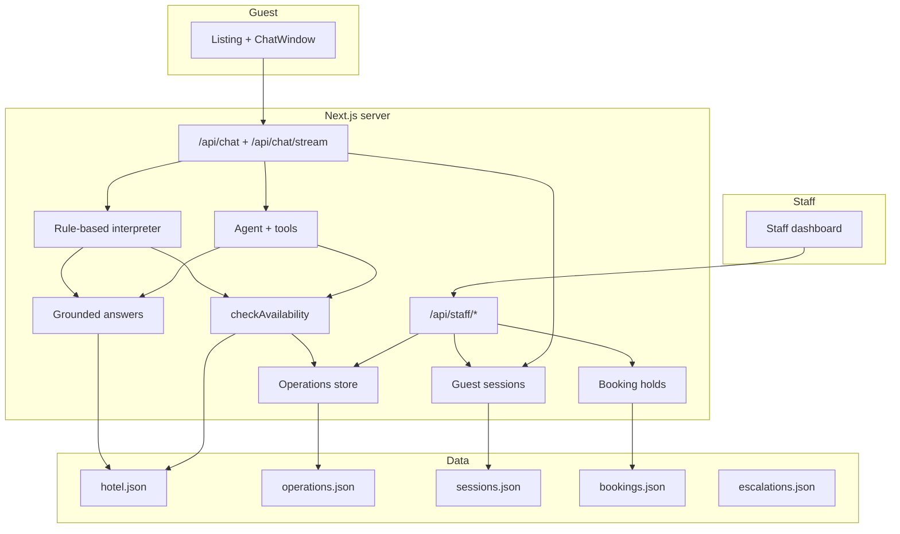

# Architecture & Major Design Choices

This document explains how **Asteria Grand Hotel** is built, why key decisions were made, and where the important boundaries sit between AI, deterministic business logic, guest experience, and staff operations.

Repository: [github.com/RealBhupesh/Aichatbot](https://github.com/RealBhupesh/Aichatbot)

---

## 1. System overview

Asteria is a **single Next.js 16 application** with:

- A guest-facing listing + chat experience at `/`
- A staff front-desk console at `/staff/desk`
- Server-only API routes under `/api/chat` and `/api/staff/*`

There is no separate backend service, BFF, or microservice layer. That keeps deployment simple (one Vercel project), reduces latency for chat, and makes the assignment-sized codebase easy to reason about.



---

## 2. Core architectural principles

### 2.1 AI understands language; code owns truth

The model is never asked “is this room available?” or “what is the cancellation policy?”. Instead:

| Responsibility | Owner |
| --- | --- |
| Intent, follow-ups, date extraction, conversational tone | LLM or rule-based interpreter |
| Inventory, prices, capacity, policies, amenities | Deterministic backend (`lib/availability.ts`, `lib/answers.ts`, `data/hotel.json`) |
| Booking state transitions | `lib/bookings.ts` |
| Request/response shape | Zod schemas in `lib/schemas.ts` |

This split prevents the most common hospitality-chat failure mode: a fluent assistant that confidently invents availability or policy terms.

### 2.2 Server-only AI credentials

`GROQ_API_KEY` and all model calls live exclusively in server modules (`lib/ai.ts`, `lib/agent.ts`, `lib/agent-stream.ts`). The browser talks only to `/api/chat` and `/api/chat/stream`. API keys never reach the client bundle.

### 2.3 Structured responses, not free-form HTML

Every chat turn returns a typed `ChatResponse` (`type`, `message`, `rooms`, `images`, `actions`, `suggestions`, …). The UI renders from that contract. Assistant text is plain text / markdown-safe content — there is no path for the model to inject HTML.

### 2.4 Guest-safe errors

Domain failures (validation, model timeout, inventory error) map to copy the guest can act on. HTTP `200` is used for handled chat errors so the UI can render the message; `400` is reserved for malformed requests. Stack traces and secrets never leave the server.

### 2.5 Works without a live model

If no LLM key is configured, `lib/interpreter.ts` provides deterministic intent and slot extraction. Tests and Playwright use this path so CI does not depend on provider uptime or spend.

---

## 3. Guest experience architecture

### 3.1 Listing-first, not chat-widget-first

`app/page.tsx` renders an Airbnb-style reception mosaic. **Talk** opens `ChatWindow` as a host conversation with Leela. Hotel photography (desk, rooms, pool, breakfast) is part of the answer surface, not decoration.

**Why:** Hospitality discovery is visual. A chat bolted onto a brochure page feels secondary; a listing with a host matches how guests already evaluate stays.

### 3.2 Hybrid input: natural language + structured forms

Guests can type freely or use:

- Suggested prompts
- A date/guest availability form (`source: "availability_form"`)
- Guest contact forms before booking

**Why:** Language is great for “Do you have a pool?” but bad for exact ISO dates and occupancy. Wrong dates are business errors, not NLU errors.

### 3.3 Server-backed guest sessions

Each guest gets an `asteria_guest` HTTP-only cookie pointing to a server session in `data/sessions.json` (via `lib/sessions.ts`).

Sessions store:

- Message history (user, assistant, staff)
- Stay snapshot (dates, guests, budget, selected room)
- Guest contact details
- Pending hold / change state
- Mode (`ai` vs `staff`) and assignment metadata

**Why:** Staff takeover, booking requests, and poll-based sync all require durable server state — browser-only history is not enough.

### 3.4 Streaming agent replies (default)

When `AGENT_MODE=true` and `STREAM_MODE=true` (defaults), guest chat uses `POST /api/chat/stream` with **Server-Sent Events**:

- Live tool-status labels (“Checking availability…”)
- Token streaming for the assistant reply
- A final `complete` event with the full structured `ChatResponse`

Form submissions, explicit actions, staff-mode sessions, and no-LLM environments fall back to JSON `POST /api/chat`.

**Why:** Streaming makes tool-using agents feel responsive. JSON remains for deterministic, action-driven turns.

### 3.5 Polling for staff replies

`GET /api/chat/poll` lets the guest UI merge staff messages into the thread while a human has taken over. `lib/guest-poll.ts` deduplicates assistant content so live streaming and polling do not produce duplicate bubbles.

### 3.6 New conversation

`POST /api/chat/new` clears the guest cookie so “New conversation” starts a fresh server session without stale history.

---

## 4. AI layer: two execution paths

### 4.1 Legacy intent router (`AGENT_MODE=false`)

Flow in `lib/chat.ts`:

1. Validate request (Zod)
2. `interpretGuestMessage()` → structured `AssistantUnderstanding`
3. Merge stay slots from client, model, message regex, and history
4. Route by intent to grounded answers or `checkAvailability()`
5. Persist turn to session

`lib/ai.ts` calls Groq (or AI Gateway) with `generateText` + `Output.object` and a strict schema. Without a key, `lib/interpreter.ts` handles the same shape with keywords and history heuristics.

### 4.2 Agent with tools (default: `AGENT_MODE=true`)

Flow in `lib/agent.ts` / `lib/agent-stream.ts`:

1. Build tool set via `createHotelTools()` in `lib/tools/index.ts`
2. Run `generateText` / `streamText` with up to **5 tool steps**
3. Tools call the same deterministic functions the legacy router uses
4. `buildAgentChatResponse()` maps tool trace + text into `ChatResponse`

Available tools include:

- `checkAvailability`
- `getHotelInfo`, `getRoomInfo`, `getAmenityInfo`, `getPolicyInfo`
- `prepareBookingHold` / booking submission
- `escalateToStaff`
- Reservation lookup and modification helpers

**Why agent mode:** One model turn can chain “check dates → show rooms → collect contact → submit booking request” without hard-coding every multi-step script in the router.

**Why keep the legacy path:** Predictable fallback, simpler tests, and a smaller surface when `AGENT_MODE=false`.

### 4.3 Model provider selection

Priority in `lib/ai.ts`:

1. `GROQ_API_KEY` → `@ai-sdk/groq` (default model `openai/gpt-oss-120b`)
2. Else `AI_GATEWAY_API_KEY` or `LLM_API_KEY` → Vercel AI Gateway
3. Else rule-based interpreter

---

## 5. Knowledge & availability

### 5.1 Hotel knowledge (`data/hotel.json`)

Authoritative for:

- Check-in / check-out times
- Contact details
- Amenities and policies
- Room types, capacity, beds, breakfast, baseline nightly rates

`lib/hotel.ts` reads the file. `lib/answers.ts` composes guest-facing replies from that data. Unknown services get a **fallback** (“I don't have reliable information…”) rather than a fabricated denial.

### 5.2 Staff-controlled operations (`data/operations.json`)

Staff can change per-room:

- Inventory count
- Nightly rate
- Closed flag
- Blackout dates

Plus hotel-wide closed dates. `lib/availability.ts` and `lib/operations.ts` merge JSON defaults with staff overrides.

### 5.3 Deterministic availability

`checkAvailability({ checkIn, checkOut, adults })`:

- Validates ISO dates and guest count (1–8)
- Filters by `maxGuests`
- Computes remaining inventory per night from operations data
- Returns priced room offers — **no randomness**

The model may suggest checking dates; only this function decides what is open.

---

## 6. Booking architecture (staff-confirmed)

We chose **Option A: staff-confirmed bookings** rather than instant guest confirmation.

### Flow

1. Guest selects a room and provides **phone** (required)
2. `submitBookingRequest()` creates a `pending_staff` hold in `data/bookings.json`
3. Staff see the request in **Overview → Booking requests** with a phone link
4. Staff **Confirm** → inventory decrements, confirmation code `AST-xxxx` issued, message posted to guest chat
5. Staff **Decline** → guest notified in chat; hold marked `declined`

### Why staff confirmation

- Matches a real boutique hotel workflow (desk calls to confirm)
- Avoids guests believing they have a reservation before payment/details are verified
- Gives staff a human checkpoint before inventory is committed

### Security

- Hold tokens are HMAC-signed (`STAFF_SECRET` / `STAFF_PASSWORD`)
- Confirmation codes are generated server-side only after staff action

---

## 7. Staff console architecture

### 7.1 Authentication

- Password login at `/staff/login`
- HMAC session cookie (`lib/staff-cookie.ts`, `lib/staff-auth.ts`)
- `proxy.ts` guards `/staff/*` and `/api/staff/*` (Next.js 16 routing middleware)

Production requires `STAFF_PASSWORD` (and ideally `STAFF_SECRET`) in environment variables.

### 7.2 Four desk tabs

| Tab | Purpose |
| --- | --- |
| **Overview** | Pending booking requests, open holds, quick session access |
| **Conversations** | Full thread view, takeover, reply as staff, hand back to Leela |
| **Escalations** | Open tickets created when the agent escalates |
| **Operations** | Inventory, rates, closures, blackouts |

### 7.3 Takeover model

- `POST /api/staff/sessions/:id/takeover` sets `mode: "staff"`
- Staff messages append with `role: "staff"` and appear in the guest poll stream
- `POST .../handback` returns control to Leela (`mode: "ai"`)

The conversations UI uses a **viewport-filling layout** so the thread and reply box stay on screen during takeover.

### 7.4 Notifications

`lib/notifications.ts` logs all staff events and optionally POSTs to `STAFF_ALERT_WEBHOOK` (Slack, Discord, Zapier, etc.) for escalations, takeovers, and booking requests.

---

## 8. Persistence & deployment

### 8.1 File-backed JSON stores

| File | Contents |
| --- | --- |
| `data/hotel.json` | Static hotel content (read-only in production) |
| `data/operations.json` | Staff inventory/rate overrides |
| `data/sessions.json` | Guest conversations and state |
| `data/bookings.json` | Holds and confirmation codes |
| `data/escalations.json` | Escalation tickets |

### 8.2 Vercel serverless adaptation (`lib/data-files.ts`)

Vercel’s function filesystem is read-only except `/tmp`. Writable stores resolve to `/tmp/asteria-data` when `VERCEL` is set, seeding from bundled `data/*.json` on first access. Override with `DATA_DIR` if needed.

**Production caveat:** `/tmp` is ephemeral per function instance. This is acceptable for a demo/MVP but **not** a durable multi-instance store. The next production step is Vercel Postgres, Blob, Redis, or a PMS integration.

### 8.3 Environment variables

See `.env.example` and the README. Minimum for a live deployment:

- `GROQ_API_KEY` (Preview **and** Production on Vercel)
- `STAFF_PASSWORD`
- `STAFF_SECRET` (recommended)

---

## 9. API surface

### Guest

| Route | Method | Role |
| --- | --- | --- |
| `/api/chat` | POST | JSON chat turn (forms, actions, fallback) |
| `/api/chat/stream` | POST | SSE agent stream |
| `/api/chat/poll` | GET | Staff message sync |
| `/api/chat/new` | POST | Reset guest session cookie |

### Staff (auth required)

| Route | Role |
| --- | --- |
| `/api/staff/login`, `/logout` | Session management |
| `/api/staff/sessions` | List/search conversations |
| `/api/staff/sessions/:id` | Read one conversation |
| `/api/staff/sessions/:id/takeover` | Staff takes chat |
| `/api/staff/sessions/:id/handback` | Return to AI |
| `/api/staff/sessions/:id/messages` | Staff reply |
| `/api/staff/bookings` | Pending booking requests |
| `/api/staff/bookings/:id/confirm` | Confirm booking |
| `/api/staff/bookings/:id/decline` | Decline booking |
| `/api/staff/operations` | Read/write inventory |
| `/api/staff/escalations` | Escalation queue |

---

## 10. Security summary

- LLM keys server-only
- Zod validation on all chat and staff inputs
- Model structured output re-validated with Zod
- Staff routes behind HMAC cookie + `proxy.ts`
- Hold tokens signed; timing-safe comparison
- Logging redacts secrets and truncates payloads (`lib/logger.ts`)
- Guest cookies: `httpOnly`, `sameSite: lax`, `secure` in production

---

## 11. Testing strategy

| Layer | Tool | Notes |
| --- | --- | --- |
| Unit | Vitest (75 tests) | Hotel facts, availability, bookings, sessions, agent response, guest poll dedupe |
| API | Vitest | `tests/chat-api.test.ts` hits route handlers directly |
| E2E | Playwright | Guest flow + staff login; forces rule-based interpreter |

Tests avoid live LLM calls for determinism and cost control.

---

## 12. Known production gaps

Documented intentionally — acceptable for an assignment/MVP, not for a paid PMS replacement:

1. **Durable persistence** — migrate JSON/`/tmp` to a real database
2. **PMS / payment integration** — bookings are mock holds, not card captures
3. **Rate limiting** — no per-IP/session throttle on chat yet
4. **Observability** — JSON logs only; no distributed tracing or eval pipeline
5. **Multilingual** — English only
6. **Per-instance `/tmp`** — staff may not see sessions created on another function instance without shared storage

See also [PRODUCT_DECISIONS.md](./PRODUCT_DECISIONS.md) for product rationale and [EVALUATION.md](./EVALUATION.md) for automated test results.

---

## 13. Key module map

```
app/
  page.tsx                 # Guest listing
  api/chat/                # Guest chat routes
  api/staff/               # Staff API
  staff/desk/page.tsx      # Staff dashboard shell

components/
  desk/                    # Reception listing UI
  chat/                    # ChatWindow, streaming, forms
  staff/                   # Dashboard panels

lib/
  ai.ts                    # LLM provider + legacy interpret
  agent.ts / agent-stream.ts # Tool-calling agent
  tools/index.ts           # Hotel tool definitions
  chat.ts                  # Legacy orchestrator
  chat-actions.ts          # Booking/hold actions
  availability.ts          # Inventory engine
  answers.ts               # Grounded reply builders
  sessions.ts              # Guest session store
  bookings.ts              # Hold + staff confirmation
  data-files.ts            # Vercel-safe file paths
  schemas.ts               # Zod contracts
  proxy.ts                 # Staff auth guard
```

---

## 14. Decision log (quick reference)

| Decision | Choice | Rationale |
| --- | --- | --- |
| Framework | Next.js App Router | SSR listing, colocated API routes, Vercel-native deploy |
| AI SDK | Vercel AI SDK v7 + Groq | Streaming, tool calling, structured output |
| Default AI mode | Agent with tools | Multi-step flows without bespoke routers |
| Availability | Deterministic function | Prevent hallucinated inventory |
| Booking confirmation | Staff-confirmed | Realistic hotel ops; avoids false confirmations |
| Session store | JSON files + `/tmp` on Vercel | Zero external deps for MVP; known migration path |
| Staff auth | Password + HMAC cookie | Simple for demo; upgrade path to SSO |
| Guest sync during takeover | HTTP polling | No WebSocket infra required on serverless |
| Styling | Tailwind 4 + DaisyUI | Fast iteration, consistent components |
| Tests without LLM | Rule-based interpreter fallback | Reliable CI, no API spend |
