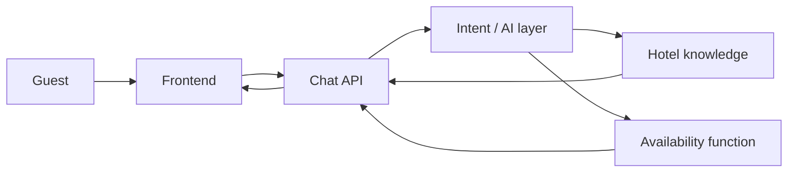

# Architecture

Asteria’s guest assistant is a single Next.js application. The UI is a React client. The only backend surface is `POST /api/chat`. That route validates input, interprets the guest’s message, reads hotel facts from JSON, and — when the guest is asking about dates — calls a deterministic availability function.

## Frontend

`app/page.tsx` is a server component. It renders an Airbnb-style listing with a five-photo reception mosaic. Talk opens the client `ChatWindow`.

`ChatWindow` owns conversation state:

- Messages are local React state. Recent turns are sent back to the API as `history`.
- Sending a message disables the input, shows a typing indicator, and prevents duplicate submits.
- Assistant turns include `images` from the hotel photo set (reception, rooms, pool, breakfast).
- `type: "availability_request"` reveals the date/guest form.
- `type: "availability_results"` renders room cards with photos inside that assistant turn.
- Network failures and `type: "error"` expose a Retry control.
- Assistant text is rendered as plain text (`whitespace-pre-wrap`). There is no HTML injection path.

Staff use `/staff` (login + `/staff/desk`). Session is an HMAC cookie. Inventory writes go to `data/operations.json` through `PUT /api/staff/operations`.

The availability form is a structured control because dates and occupancy must be exact. Suggested questions exist so a first-time guest can start without guessing what the assistant can do.

## Backend

`app/api/chat/route.ts` is a Node.js Route Handler. It parses JSON, then delegates to `processChatRequest()` in `lib/chat.ts`.

That orchestrator:

1. Validates the body with Zod (`lib/schemas.ts`).
2. Short-circuits form submissions (`source: "availability_form"`) to `checkAvailability()`.
3. Otherwise calls `interpretGuestMessage()`.
4. Merges extracted stay slots with any values the client already collected.
5. For availability, asks only for missing fields or runs the inventory function.
6. For hotel/room/amenity/policy questions, returns a message grounded in `data/hotel.json`.
7. Maps thrown model or inventory errors to guest-safe responses.

The HTTP status is `400` for malformed requests and `200` for handled domain errors so the chat UI can render the message.

## AI layer

`lib/ai.ts` is the only module that talks to a model.

When `GROQ_API_KEY` is set, it calls `generateText` through `@ai-sdk/groq` with `Output.object`. The default model is `openai/gpt-oss-120b`. If Groq is unset, `AI_GATEWAY_API_KEY` or `LLM_API_KEY` can still route through the Vercel AI Gateway. The schema requires intent, a reply, optional room id, and availability slots. The model is instructed to use only the supplied hotel JSON and never to decide inventory.

When no key is configured, `lib/interpreter.ts` performs the same slot/intent job with keyword and history heuristics. Automated tests use this path so they do not depend on live model output.

AI is used for language: intent, follow-ups, and extracting dates/guest counts from prose. It is not used for stock, price, or policy truth.

## Knowledge layer

`data/hotel.json` is the authoritative source for:

- Check-in / check-out
- Contact details
- Amenities
- Policies
- Room types, capacity, beds, amenities, breakfast, and nightly price

`lib/hotel.ts` and `lib/answers.ts` read that file. If a service is not listed, the assistant says the information is not in the hotel details and points the guest to the front desk. It does not treat “not in the file” as a confirmed “we do not offer this” operations decision, except where the policy JSON is explicit (pets, smoking).

## Availability layer

`lib/availability.ts` implements `checkAvailability({ checkIn, checkOut, adults })`.

It is deterministic:

- ISO dates, check-out after check-in, check-in not in the past
- Guest count 1–8
- Rooms filtered by `maxGuests`
- Remaining inventory derived from room id + calendar date, plus staff blackout nights and hotel-closed dates in `data/operations.json`
- No `Math.random()`

Prices come from the staff operations store (falling back to JSON nightly rates) × nights. The result is an estimate, not a booking.

Staff can close a room, change inventory, change the nightly rate, or add blackout dates from `/staff/desk`. Those writes are what the guest assistant reads on the next availability check.

## Data flow

## Logging

`lib/logger.ts` writes JSON lines for intent, validation failures, AI errors, availability errors, and unexpected exceptions. API keys and long free-text payloads are redacted or truncated.

## Security notes

- LLM credentials exist only on the server
- Staff session is an HMAC cookie; inventory writes require that cookie
- Request bodies are schema-validated and length-limited
- Model output is parsed with Zod before use
- Availability arguments are validated again before inventory logic runs
- The model cannot execute tools directly
